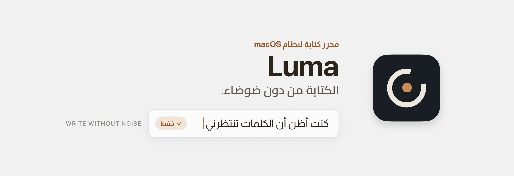
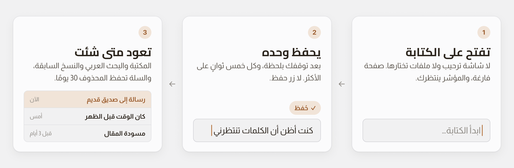

<div dir="rtl">

<div align="center">

<picture>
  <source media="(prefers-color-scheme: dark)" srcset="docs/assets/header-ar-dark.png">
  
</picture>

[](https://github.com/iSltanX/Luma/releases/latest)
[](#المتطلبات)
[](#الخصوصية)
[](LICENSE)

### [⬇︎ تنزيل أحدث إصدار](https://github.com/iSltanX/Luma/releases/latest)

<sub>مجاني ومفتوح المصدر · macOS 13 أو أحدث · Apple Silicon وIntel</sub>

[الفكرة](#الفكرة) · [طريقة العمل](#طريقة-العمل) · [الميزات](#الميزات) · [التثبيت](#التثبيت) · [الاستخدام](#الاستخدام) · [لقطات الشاشة](#لقطات-الشاشة) · [الخصوصية](#الخصوصية) · [الأسئلة المتكررة](#الأسئلة-المتكررة)

</div>

---

## الفكرة

أكثر محررات الكتابة تبدأ بشيء غير الكتابة: مجلد تختاره، أو قالب، أو لوحة أدوات. والعربية فيها غالبًا ضيف.

محرّر **Luma** هادئ للكاتب العربي: يفتح مباشرة على صفحة فارغة، ويحفظ وحده، ويُبقي أدواته في الخلفية حتى تحتاجها. ليس مدير ملاحظات مزدحمًا، بل محرر له مكتبة جانبية خفيفة.

> الكتابة الجيدة تحتاج هدوءًا، لا أدوات أكثر.

---

## طريقة العمل

<picture>
  <source media="(prefers-color-scheme: dark)" srcset="docs/assets/steps-ar-dark.png">
  
</picture>

لا زر حفظ. يحفظ Luma النص بعد توقفك بلحظة، وكل خمس ثوانٍ على الأكثر، بكتابة ذرّية لا تترك ملفًا نصف مكتوب. وإن أُغلق التطبيق فجأة، فأقصى ما قد يضيع هو الثواني الأخيرة.

---

## الميزات

- **الكتابة أولًا.** كل تشغيل يفتح صفحة نظيفة، ونصوصك السابقة في المكتبة.
- **عربية أصيلة.** من اليمين إلى اليسار من الأساس، ببحث عربي في المكتبة.
- **المحرر المريح.** ثلاث طبقات لجلسات الكتابة الطويلة: الآلة الكاتبة، والتركيز، وZen.
- **سجل زمني.** نسخ سابقة تُحفظ تلقائيًا، تعاينها وتستعيدها، وتُحفظ نسخة أمان قبل كل استعادة.
- **سلة آمنة.** المحذوف يبقى 30 يومًا قبل أن يُفرَّغ، وتستعيده متى شئت.
- **تصدير.** إلى Markdown، أو نص عادي، أو PDF.
- **مظهر تختاره.** خمس سمات هادئة: Paper وMist وSage وLavender وMidnight، مع الخط والحجم وتباعد الأسطر وعرض الصفحة.

---

## التثبيت

1. نزّل ملف <span dir="ltr">`Luma_…_universal.dmg`</span> من [صفحة الإصدارات](https://github.com/iSltanX/Luma/releases/latest).
2. افتحه واسحب **Luma** إلى مجلد **التطبيقات**.
3. شغّله، واكتب.

</div>

> [!IMPORTANT]
> **تنبيه Gatekeeper:** Luma موقَّع ذاتيًا لا بشهادة Apple Developer ID، ولم يمرّ بتوثيق Apple، لأنه مشروع شخصي. لذلك قد يظهر عند أول فتح أن «التطبيق تالف» أو «من مطوّر غير معروف»، والتطبيق سليم.
>
> - **في macOS 15 فما بعد:** حاول فتحه مرة، ثم افتح **إعدادات النظام ← الخصوصية والأمن** واضغط **افتح على أي حال**.
> - **في macOS 13 و14:** في Finder انقر على Luma بالزر الأيمن ← **فتح** ← **فتح**.
>
> وإن استمر المنع، فمن الطرفية:
> ```sh
> xattr -cr /Applications/Luma.app
> ```

<div dir="rtl">

### المتطلبات

- نظام macOS 13 (Ventura) أو أحدث.
- معالج Apple Silicon أو Intel، بحزمة Universal واحدة.

---

## الاستخدام

| الإجراء | الاختصار |
| --- | --- |
| المحرر المريح | <span dir="ltr"><kbd>⌃</kbd><kbd>⌘</kbd><kbd>F</kbd></span> |
| الإعدادات | <span dir="ltr"><kbd>⌘</kbd><kbd>,</kbd></span> |
| تراجع، ثم إعادة | <span dir="ltr"><kbd>⌘</kbd><kbd>Z</kbd></span> · <span dir="ltr"><kbd>⇧</kbd><kbd>⌘</kbd><kbd>Z</kbd></span> |
| نقل النص إلى السلة | <span dir="ltr"><kbd>⌘</kbd><kbd>⌫</kbd></span> |
| الخروج من المحرر المريح أو إغلاق اللوحة | <kbd>Esc</kbd> |

- **التصدير:** من القائمة **ملف ← حفظ بصيغة…**، واختر Markdown أو نصًّا عاديًا أو PDF. ملف PDF يُطبع دائمًا على ورق أبيض.
- **النسخ السابقة:** من السجل الزمني للمستند، وتُعاين قبل استعادتها.
- **السلة:** من **الإعدادات ← السلة**.

---

## لقطات الشاشة

<table>
  <tr>
    <td width="50%" align="center" valign="top">
      <br>
      <b>المحرر والمكتبة</b><br>
      النص أولًا، والمكتبة إلى جانبه حين تحتاجها.
    </td>
    <td width="50%" align="center" valign="top">
      <br>
      <b>المحرر المريح</b><br>
      تركيز على السطر الحالي، وأدوات تظهر عند التحديد.
    </td>
  </tr>
  <tr>
    <td width="50%" align="center" valign="top">
      <br>
      <b>السجل الزمني</b><br>
      نسخ المستند بتواريخها، محفوظة وحدها.
    </td>
    <td width="50%" align="center" valign="top">
      <br>
      <b>السمات</b><br>
      خمس سمات هادئة، أربع فاتحة وواحدة داكنة.
    </td>
  </tr>
</table>

<details>
<summary><b>بقية اللقطات</b></summary>

<table>
  <tr>
    <td width="50%" align="center" valign="top">
      <br>
      <b>إعدادات المحرر المريح</b><br>
      الآلة الكاتبة والتركيز وZen.
    </td>
    <td width="50%" align="center" valign="top">
      <br>
      <b>معاينة نسخة سابقة</b><br>
      تقرأها كاملة قبل أن تستعيدها.
    </td>
  </tr>
</table>

</details>

---

## الخصوصية

- **لا شبكة أبدًا.** Luma لا يتصل بالإنترنت، ولا يتحقق من التحديثات تلقائيًا.
- **لا حساب، ولا مزامنة، ولا تتبّع.**
- **نصوصك على جهازك:** في <span dir="ltr">`~/Library/Application Support/Luma/`</span>، ملفات JSON مع نسخها السابقة.

---

## الأسئلة المتكررة

<details>
<summary><strong>لماذا يقول macOS إن التطبيق تالف؟</strong></summary><br>

لأن Luma موقَّع ذاتيًا لا بشهادة Apple Developer ID. التطبيق سليم، وطريقة الفتح في [التثبيت](#التثبيت).
</details>

<details>
<summary><strong>أين زر الحفظ؟</strong></summary><br>

لا يوجد. Luma يحفظ بعد توقفك عن الكتابة بأقل من ثانية، وكل خمس ثوانٍ على الأكثر أثناء الكتابة المتواصلة.
</details>

<details>
<summary><strong>لماذا يفتح دائمًا على صفحة فارغة؟</strong></summary><br>

لأن الكتابة الجديدة هي الأصل. نصوصك السابقة كلها في المكتبة الجانبية، والصفحة التي تغادرها فارغة تُحذف وحدها.
</details>

<details>
<summary><strong>متى تُحفظ نسخة في السجل الزمني؟</strong></summary><br>

بعد تغيير 80 حرفًا على الأقل، حتى 100 نسخة أو 20 ميغابايت لكل مستند. وقبل أي استعادة تُحفظ نسخة أمان من الحالة الحالية.
</details>

<details>
<summary><strong>حذفت نصًّا بالخطأ، كيف أستعيده؟</strong></summary><br>

من **الإعدادات ← السلة**. المحذوف يبقى هناك 30 يومًا.
</details>

<details>
<summary><strong>هل يمكنني نقل نصوصي إلى تطبيق آخر؟</strong></summary><br>

نعم، من **ملف ← حفظ بصيغة…** إلى Markdown أو نص عادي أو PDF.
</details>

<details>
<summary><strong>كيف أحدّثه، وكيف أزيله؟</strong></summary><br>

**التحديث** يدوي: نزّل الإصدار الجديد من صفحة الإصدارات واستبدل التطبيق.

**الإزالة:** احذف Luma من مجلد التطبيقات، ثم احذف مجلد <span dir="ltr">`~/Library/Application Support/Luma/`</span>. انتبه: فيه نصوصك، فصدّر ما تحتاجه أولًا.
</details>

---

## للمطوّرين

<details>
<summary><b>البناء من المصدر</b></summary><br>

**المتطلبات:** Node 24 (<span dir="ltr">`.nvmrc`</span>)، وRust 1.82 أو أحدث، وأدوات سطر أوامر Xcode.

| الأمر | ما يفعله |
| --- | --- |
| <span dir="ltr">`npm install`</span> | يثبّت الاعتماديات |
| <span dir="ltr">`npm run app`</span> | تشغيل تطويري للتطبيق |
| <span dir="ltr">`npm run verify`</span> | svelte-check وclippy وfmt واختبارات الواجهة والنواة |
| <span dir="ltr">`npm run test:e2e`</span> | اختبارات Playwright في WebKit وChromium |
| <span dir="ltr">`npm run app:build:universal`</span> | يبني حزمة Universal |

مبني بـ Tauri 2 وRust، بواجهة Svelte 5 وTypeScript، ومحرر ProseMirror. قرارات التصميم الهندسية في [docs/decisions](docs/decisions)، وسجل التغييرات في [CHANGELOG.md](CHANGELOG.md).
</details>

## الرخصة

مرخَّص بـ[MIT](LICENSE). الخطّان **Cairo** و**Almarai** برخصة SIL Open Font License 1.1.

---

<div align="center">


**تصميم وتطوير: سلطان** · Designed & developed by Sultan

الموقع: [bysltan.com](https://www.bysltan.com)

من الصانع نفسه<br>
تطبيقات macOS: [بدّل](https://github.com/iSltanX/Baddel) · [رفّ](https://github.com/iSltanX/Raff) · [نفّذ](https://github.com/iSltanX/naffith)<br>
إضافات المتصفح: [SnRead](https://github.com/iSltanX/SnRead) · [صَوْب](https://github.com/iSltanX/SAWB) · [جسور](https://github.com/iSltanX/Jusoor)

<sub>[سجل التغييرات](CHANGELOG.md) · [الإصدارات](https://github.com/iSltanX/Luma/releases)</sub>

</div>

</div>
