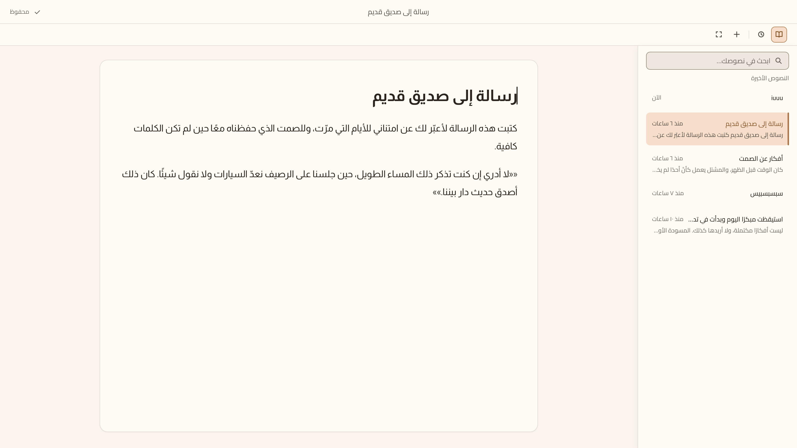
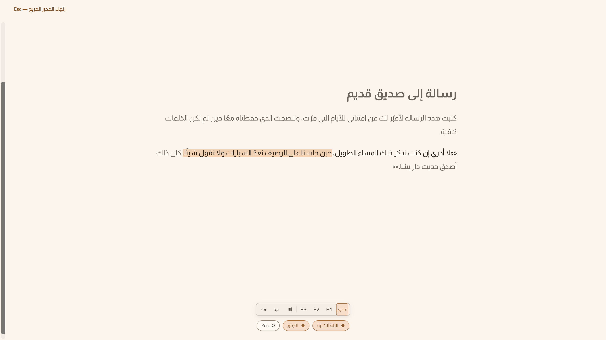
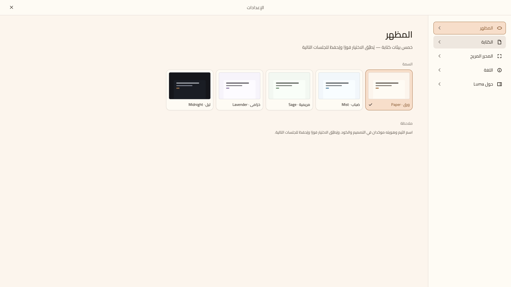
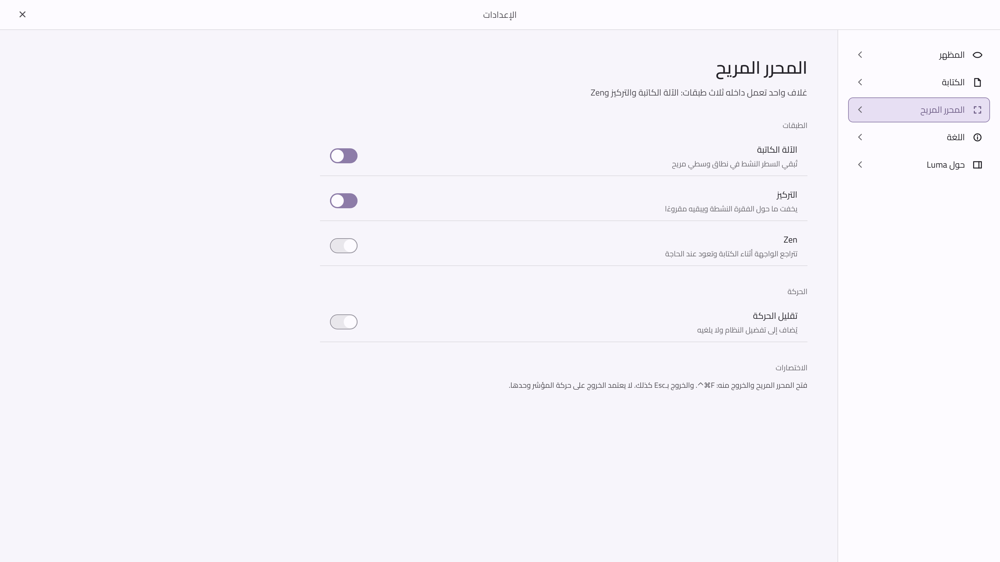
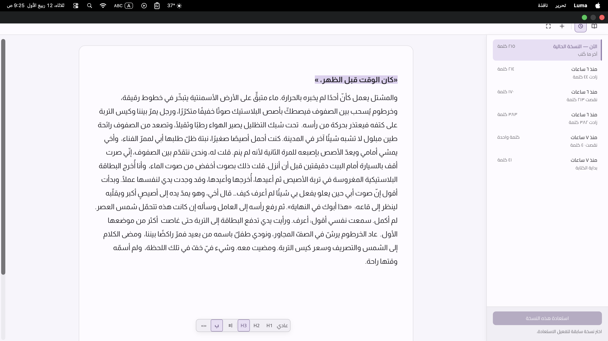
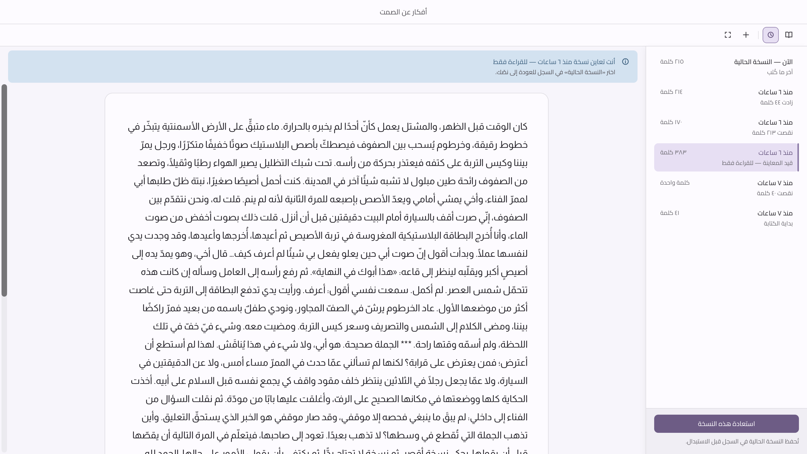

<p align="center">
  
</p>

<h1 align="center">Luma</h1>

<p align="center">
  <strong>WRITE WITHOUT NOISE · الكتابة من دون ضوضاء</strong>
</p>

<p align="center" dir="rtl">
  محرر كتابة هادئ صُمّم للكاتب العربي على macOS — افتح واكتب، والباقي يختفي.
</p>

<p align="center">
  <a href="https://github.com/iSltanX/Luma/releases/latest">
    
  </a>
  
  
</p>

<p align="center">
  <a href="https://github.com/iSltanX/Luma/releases/latest">⬇︎ تنزيل أحدث إصدار (DMG)</a>
</p>

<p align="center">
  
</p>

> [!IMPORTANT]
> **حالة المشروع:** الإصدار **v1.1.0** جاهز للاستخدام ومتاح للتنزيل من [صفحة الإصدارات](https://github.com/iSltanX/Luma/releases/latest). الحزمة موقَّعة توقيعًا محليًا عابرًا (ad-hoc) فقط — بلا شهادة `Developer ID` مصدَّقة من Apple وبلا توزيع عبر App Store — فيلزم تجاوز تحذير Gatekeeper عند أول تشغيل (التفاصيل في قسم التثبيت أدناه).

## عن Luma · About Luma

**Luma** محرر كتابة هادئ للكاتب العربي على macOS. يفتح مباشرة على النص، يحفظ تلقائيًا، ويُبقي الأدوات في الخلفية حتى تظل المسافة بين الفكرة والكتابة أقصر ما يمكن.

لم يُبنَ Luma ليكون مدير ملاحظات مزدحمًا؛ إنه **محرر كتابة له مكتبة جانبية خفيفة**. العربية واتجاه RTL جزء أصيل من التجربة، والنص هو العنصر الأول دائمًا.

> الكتابة الجيدة تحتاج هدوءًا، لا أدوات أكثر.

## المزايا · Key Features

- **الكتابة أولًا:** محرر جاهز فور فتح التطبيق، بلا شاشة ترحيب أو خطوات تسبق الكتابة.
- **عربية أصيلة:** تجربة RTL مصممة للعربية من الأساس، مع تنسيق هادئ يخدم النص ولا يزاحمه.
- **المحرر المريح:** طبقات الآلة الكاتبة والتركيز وZen لجلسات كتابة طويلة بلا تشتيت.
- **حفظ محلي موثوق:** حفظ تلقائي وكتابة ذرّية؛ ما كُتب محفوظ في المكتبة مهما كان الإغلاق مفاجئًا، وكل تشغيل يفتح مساحة نظيفة.
- **مكتبة وسجل زمني:** عودة سريعة إلى النصوص، بحث عربي، ومعاينة نسخ سابقة واستعادتها بأمان.
- **تجربة قابلة للتخصيص:** خمسة ثيمات هادئة، وخيارات للخط والحجم وتباعد الأسطر وعرض مساحة الكتابة.
- **خصوصية بلا تنازلات:** لا حساب، ولا مزامنة، ولا تتبع، ولا اتصال بالشبكة؛ نصوصك تبقى على جهازك.

## v1.1.0 · الإصدار الحالي

| البيان | التفاصيل |
| --- | --- |
| الإصدار | `v1.1.0` |
| الحالة | **متاح للتنزيل** |
| المنصة | macOS 13.0 أو أحدث |
| التوزيع العام | [صفحة الإصدارات](https://github.com/iSltanX/Luma/releases/latest) — DMG موقَّع توقيعًا محليًا عابرًا (ad-hoc)، غير موثَّق من Apple |

يركّز **v1.1.0** على وضع أساس متين لتجربة كتابة عربية هادئة: محرر سريع، حفظ يمكن الوثوق به، مكتبة خفيفة، سجل زمني، محرر مريح، وخيارات مظهر تخدم القراءة الطويلة من دون تحويل الكتابة إلى لوحة تحكم.

## لقطات من التطبيق · Screenshots

<table>
  <tr>
    <td width="50%" align="center">
      
      <br />
      <sub>المحرر المريح — تركيز وأدوات تظهر عند الحاجة</sub>
    </td>
    <td width="50%" align="center">
      
      <br />
      <sub>خمسة ثيمات هادئة للكتابة</sub>
    </td>
  </tr>
  <tr>
    <td width="50%" align="center">
      
      <br />
      <sub>إعدادات الآلة الكاتبة والتركيز وZen</sub>
    </td>
    <td width="50%" align="center">
      
      <br />
      <sub>السجل الزمني ونسخ المستند</sub>
    </td>
  </tr>
  <tr>
    <td colspan="2" align="center">
      
      <br />
      <sub>معاينة نسخة سابقة قبل استعادتها</sub>
    </td>
  </tr>
</table>

## الخصوصية أولًا · Privacy First

تُحفظ النصوص محليًا داخل جهازك. لا يحتاج Luma إلى حساب، ولا يرسل محتواك إلى خدمة خارجية، ولا يحتوي على مزامنة أو أدوات تتبع. أنت تكتب، وكتابتك تبقى لك.

## التثبيت · Installation

نزّل `Luma_1.1.0_universal.dmg` من [صفحة الإصدارات](https://github.com/iSltanX/Luma/releases/latest) — يعمل على Apple Silicon وIntel معًا (أدنى إصدار مدعوم **macOS 13.0**). افتح الصورة واسحب Luma إلى «التطبيقات».

> [!NOTE]
> **تحذير Gatekeeper متوقَّع.** هذا الإصدار موقَّع توقيعًا محليًا عابرًا (ad-hoc) لا بشهادة `Developer ID` مصدَّقة من Apple — العضوية في برنامج مطوّري Apple لا تزال معلَّقة — وبلا توزيع عبر App Store. أول فتح سيُظهر على الأرجح رسالة «التطبيق تالف» أو «من مطوّر غير معروف»، والتطبيق سليم؛ الرسالة أثر التوقيع العابر لا عطبًا فعليًا. للتجاوز بعد نقله إلى «التطبيقات»:
>
> ```bash
> xattr -cr /Applications/Luma.app
> ```

## التطوير محليًا · Development

> هذا المسار مخصص لمن يريد البناء من المصدر أو المساهمة في التطوير، وليس مطلوبًا للتثبيت العادي — استخدم DMG من قسم التثبيت أعلاه.

```bash
npm install
npm run app
```

لتشغيل فحوصات المشروع:

```bash
npm run verify
```

## التقنيات · Tech Stack

`Tauri 2` · `Rust` · `Svelte 5` · `TypeScript` · `ProseMirror` · `Vite`

---

<p align="center" dir="rtl">
  صُمّم وطُوّر بواسطة <a href="https://github.com/iSltanX">سلطان</a>.
</p>
